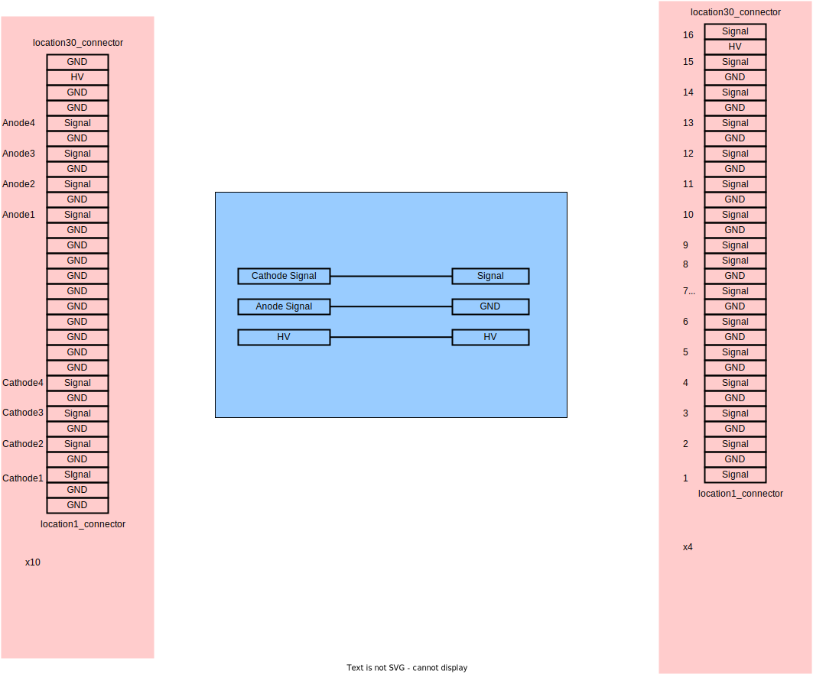

# SiPM readout electronics
*  whole detector have 3 boxes, each box have 2 layers scintillator, they are located in x,y direction.
## Basic connection

## SiPM board

## Connector

## FEE (front end Electronics)

