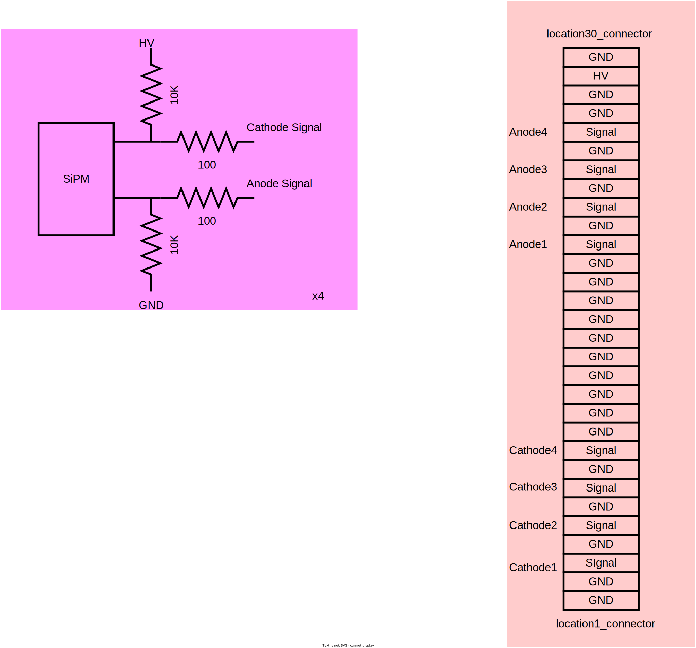

# SiPM readout electronics
## Detector
* there are 3 boxes
* each box have 2 layers scintillator, they are located in x,y direction.
* each layer have 10 modules, each module have 4 scintillator bars
* each scintillator bar have 1 SiPMs
* we have 3 * 2 * 10 * 4 = 240 Scintillator and SiPMs in total
## Basic connection
* each layer connect to one FEE and FPGA board
* each FEE and FPGA board have 64 channels,but we only use 40 channels
* each box have 2 FEE and FPGA board
* The FEE and FPGA board get CLK from DAQ and use LVDS send data to DAQ
* One DAQ get 3 boxes data and send to PC
* we can set the coincidence mode and coincidence window in DAQ by configure the switch on the board

## SiPM board
* each SiPM board have 4 SiPMs
* each SiPM have 2 signal output, one is positive, one is negative
* SiPM board get HV from connector

## Connector board
* each connector board connect to 10 SiPM board
* connector get the cathode signal from SiPM board and send to FEE board
* connector get the anode signal from SiPM board but send it to GND
* connector get the HV from FEE board and send it to SiPM board

## FEE (front end Electronics)
* each FEE board have 64 channels, we use 40 channels
* FEE get the cathode signal from connector board, get the HV from DC Voltage source.
* FEE get discharge signal from FPGA board and send the pulse to FPGA board

## FPGA board
* each FPGA board have 64 channels, we use 40 channels
* FPGA get the pulse from FEE board and use inner LVDS comparator compare the pulse with threshold, and get the digital signal
* we can adjust the threshold by change the register of DC/DC circuit in FPGA board. usually we set the threshold to 0.2V
* FPGA get the CLK from DAQ board and send the data to DAQ board
* all parameters and feature can be find at "discharge_time_digitalize.v" file

## DAQ (Data Acquisition)
* each DAQ board can get data from 16 FPGA board but now we only use 6 FPGA board
* DAQ board get the data from FPGA board, send CLK to FPGA board, compress data and send to PC by UART
* we can set the coincidence mode and coincidence window in DAQ by configure the switch on the board

* DAQ data format
  * FPGA board data output [1024 bit]/[128 byte] per event
  * every 2 byte is one channel data
  * 
  * [channel63high,channel63low....channel0high,channel0low]
  * if you find byte100 is 0x22,byte101 is 0x11, it means “字节序号50” ，“探测器编号3” channel data is 0x1122
* data compress
  * cosmic ray signal is rare, so we can compress the data by remove the 0 data
  * we can compress one FPGA board data to 8/16 byte
  * data format is 
  * 8bit compress[byteaddr0,byte0,byteaddr1,byte1,byteaddr2,byte2,byteaddr3,byte3]
  * 16bit compress[byteaddr0,byte0,byteaddr1,byte1,byteaddr2,byte2,byteaddr3,byte3,byteaddr4,byte4,byteaddr5,byte5,byteaddr6,byte6,byteaddr7,byte7]
  * notice that is the byte address,if a signal adc value <256,it will only cost 1 byte to store the data,if the adc value >256,it will cost 2 byte to store the data. 
  * so in the case of 8 byte compress, we can get 4 channel data at maximum, 2 channel data at minimum
  * in the case of 16 byte compress, we can get 8 channel data at maximum, 4 channel data at minimum
* data pack to User PC(uart)
  * [header(11111100),DAQ0(8/16byte),DAQ1(8/16byte),DAQ2(8/16byte),DAQ3(8/16byte),DAQ4(8/16byte),DAQ5(8/16byte),DAQ6(8/16byte)(0 now),DAQ7(8/16byte)(0 now),end(00000011)]
* user data reconstruct
  * we can use the header and end to get package
  * check package length to filter the data
  * reconstruct the data to get the channel data

